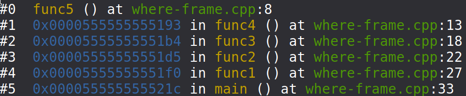
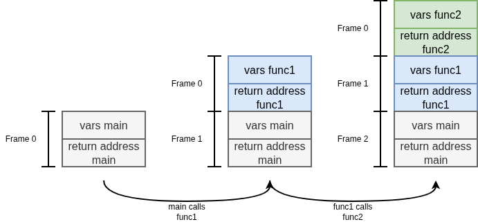

# Example using `where` and `frame`
This example demonstrates how to use the `where` and `frame` commands in GDB.
`where` shows the stack trace of the executing program at the current breakpoint.
An exemplary output of the `where` looks as the following:

The output shows the stackframes of the program in its current execution state.
A stackframe is memory region on the stack which is allocated for local variables and the return addresses of function call execution:

In other words, the stackframe is the context of the function in the current execution state.
Whenever you hit a breakpoint, `gdb` selects the highest stackframe of the current execution state.
In the output above this would be the stackframe of `func5`.
You can only inspect the selected frame at a given time.
E.g. printing variable from a not selected stackframe will result in failure.
While the program is halted, you can change the selected stackframe with the command `frame` by passing the frame number you want to select.
If no frame number is passed, the output will show the current selected frame.

The example puts a breakpoint at line 8 of the source code, which corresponds to the `return` statement of func5.
Then the example, iterates over each stackframe and prints out one local variable within each stackframe.
